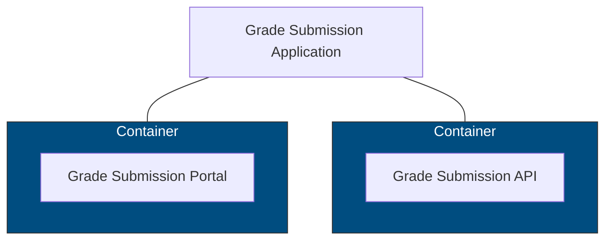

[TOC]


# Kubernetes Training

**Kubernetes** is simply a tool, a software that runs across a cluster of machines. Some of these machines are master nodes and other machines are worker nodes.

- **Master nodes** are responsible for scheduling when and where your applications will run.
- **Worker nodes** are what actually run your application.
- **Cloud native app** - one that can be distributted into many micro services, each one running inside a container. 
- **Pod** - It is the smallest unit of deployment. A container cannot be deployed directly in Kubernetes, it has to be wrapperd in pod. Pod abstracts scaling, self-healing, resource allocation, etc.


## Cloud Native App Example - Grade Submission App

- **Grade submission portal** - UI to fill data and submit grade data
- **Grade submission API** - Backend processing UI submitted data





### Pod

A Pod has metadata and runtime requirements.

#### Metadata

- Name of the pod is usually the name of microservice.
- Labels are used to place the pod into logical groups. Labelling makes it easier to query related pods.

#### Runtime requirements

- **Port** - container port where the underlying microservice serves the requests. Pod automatically exposes this port for internal traffic.
- **Resource Requirements** - Memory and CPU - required by container. This decides which worker node to be used to run the pod.
- **memory** - the workspace where a computer stores and retrieves data for immediate use. Incompressible resource.
- **CPU** - the compute that performs calculations and executes instructions. Compressible Resource
- **requests** - minimum amount of memory and CPU that application needs to function properly.
- **limits** - prevents overaccumulation of memory. Hence saving resources in node for other pods. Since CPU is compressible, let node manage CPU allocation - more CPU if available.

```yaml
apiVersion: v1
kind: Pod

# Metadata
metadata:
  name: grade-submission-portal
  labels:
    app.kubernetes.io/name: grade-submission
    app.kubernetes.io/component: frontend
    app.kubernetes.io/instance: grade-submission-portal

# Runtime Requirements
spec:
  containers:
    - name: grade-submission-portal
      image: rslim087/kubernetes-course-grade-submission-portal
      resources:
        requests:
          memory: '128Mi'
          cpu: '200m'
        limits:
          memory: '128Mi'
      ports:
        - containerPort: 5001
```

It is recommended to prefix label keys with `app.kubernetes.io` in order to avoid potential collisions with other third party labels within the Kubernetes ecosystem.

#### Create & Retreieve Pod

```shell
# Create Pod
kubectl apply -f grade-submission-portal-pod.yaml

# Retrieve Pod
kubectl get pods

# Describe Pod
kubectl describe pod grade-submission-portal

# Streaming logs
kubectl logs -f grade-submission-portal

# Delete pod using label
kubectl delete pod -l "app.kubernetes.io/name=grade-submission"
```

#### Port Forwrading

Access the pod port where the application is serving requests on the local machine. 

```shell
kubectl port-forward grade-submission-portal 8000:5001
```

After running above, access app on localhost 8000, any requests made here will be redirected to pod port 5001.

#### Multi-Container Pod

Running two containers inside of the same pod implies that the containers need to be created and terminated at the same time. They need to be scaled up or down at the same time, these are two very separate applications and need to be scaled and created independently.

So when would you ever want to have two containers in the same pod? When the microservice relies on a sidecar to provide it with additional behavior and functionality.


Both of these containers, by virtue of running in the same pod, they're going to be scheduled to the same node.

They're going to be scheduled to the same host. They are going to share the same networking, the same network namespace, which means that these two containers can communicate with each other via localhost.

```yaml
apiVersion: v1
kind: Pod

# Metadata
metadata:
  name: grade-submission-portal
  labels:
    app.kubernetes.io/name: grade-submission
    app.kubernetes.io/component: frontend
    app.kubernetes.io/instance: grade-submission-portal

# Runtime Requirements
spec:
  containers:
    # Container 1
    - name: grade-submission-portal
      image: rslim087/kubernetes-course-grade-submission-portal
      resources:
        requests:
          memory: '128Mi'
          cpu: '200m'
        limits:
          memory: '128Mi'
      ports:
        - containerPort: 5001

    # Container 2
    - name: grade-submission-portal-health-checker
      image: rslim087/kubernetes-course-grade-submission-portal-health-checker
      resources:
        requests:
          memory: '128Mi'
          cpu: '200m'
        limits:
          memory: '128Mi'

```

##### Logging

```shell
kubectl logs -f grade-submission-portal -c grade-submission-portal
kubectl logs -f grade-submission-portal -c grade-submission-portal-health-checker
```


